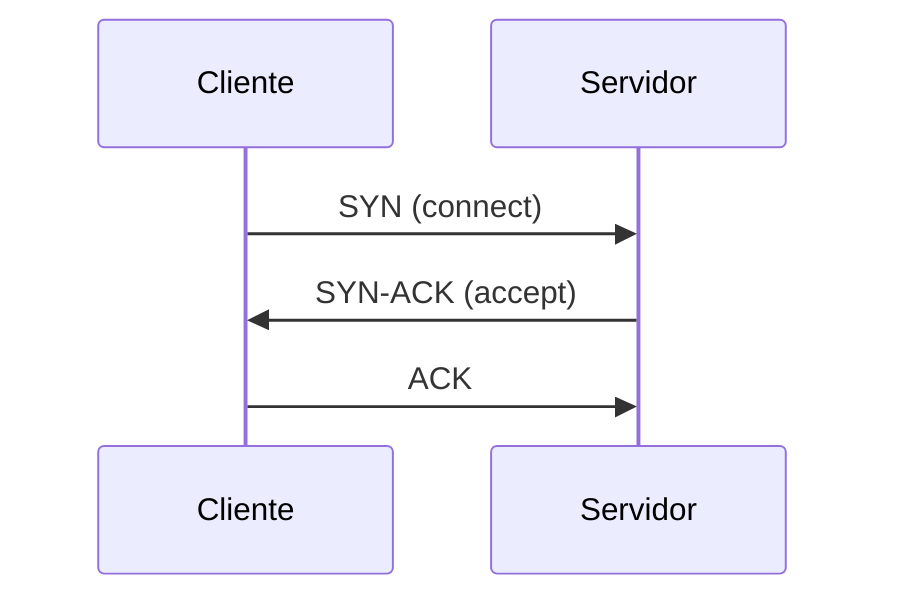
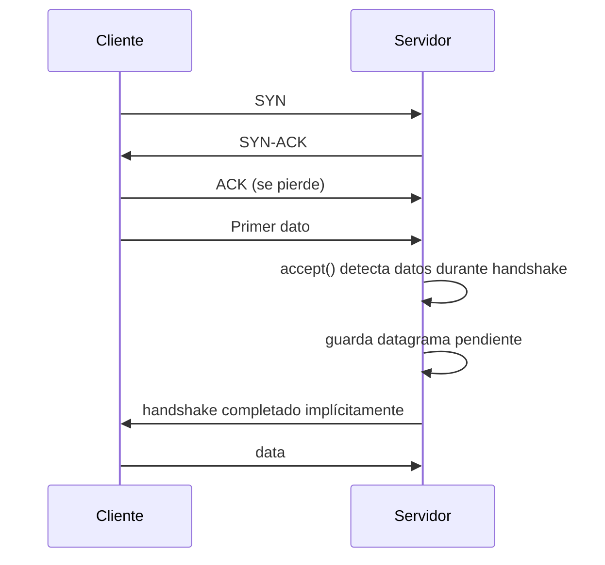

# `stopywait`

Implementación de una capa tipo TCP sobre UDP para la actividad. El objetivo es soportar 3-way handshake, Stop & Wait, partición de mensajes en trozos de 16 bytes y cierre de conexión tolerante a pérdidas.

## Componentes

- `SocketTCP.py`: clase principal con `bind`, `connect`, `accept`, `send`, `recv`, `close` y `recv_close`.
- `cliente.py`: cliente de prueba que lee desde `stdin` y envía el flujo completo.
- `servidor.py`: servidor de prueba que recibe el flujo y lo escribe por `stdout`.
- `split_recv_client.py` y `split_recv_server.py`: scripts de prueba para validar `recv(buff_size)` cuando el mensaje es mayor que `buff_size`.

## 3-way handshake

Relación con el código:

- `connect(address)`: inicia el handshake desde el cliente, elige una secuencia inicial aleatoria entre 0 y 100 y espera el `SYN-ACK`.
- `accept()`: espera `SYN`, responde con `SYN-ACK` y retorna un nuevo objeto `SocketTCP` asociado a un puerto efímero distinto.

## Paso 5: Stop & Wait

La lógica de envío y recepción se implementa sobre datagramas UDP, pero cada segmento se encapsula con headers TCP simplificados.

### `send(message)`

- Divide el mensaje en fragmentos de hasta 16 bytes.
- El primer segmento informa `message_length` para que el receptor sepa cuánto esperar.
- Cada segmento espera su ACK antes de avanzar al siguiente.
- Usa `socket.settimeout(...)` para retransmitir si un ACK no llega a tiempo.

### `recv(buff_size)`

- Si es la primera llamada para un mensaje, lee primero el segmento con `message_length`.
- Retorna cuando los datos acumulados alcanzan `min(message_length, buff_size)`.
- Si el mensaje es más grande que `buff_size`, guarda el resto internamente para futuras llamadas a `recv`.

## Caso borde: último ACK del handshake perdido

Solución aplicada:

- Si `accept()` recibe un segmento de datos antes de ver el ACK final, asume que el handshake se completó.
- El datagrama se guarda en `_pending_datagram` para que `recv()` lo procese después sin perder datos.

## Cierre de conexión

- `close()`: envía `FIN`, espera `ACK`, luego espera `FIN` de la contraparte.
- Si hay pérdidas, reintenta hasta 3 timeouts y finalmente cierra la conexión.
- `recv_close()`: recibe el `FIN`, responde con `ACK` y completa el cierre lado servidor.

## Decisiones de diseño

- Se usa un timeout fijo en UDP para simplificar la retransmisión.
- Se mantiene estado interno en `recv()` para soportar llamadas sucesivas cuando `buff_size < message_length`.
- Los datos se codifican antes de enviarse para evitar colisiones con el formato de headers.
- El puerto del socket aceptado es distinto al del socket que llama `accept()`, siguiendo la idea de conexión separada para cada par cliente-servidor.

## Pruebas realizadas

### 1. Transferencia normal

Se verificó que un archivo completo se transmite correctamente con `cliente.py` y `servidor.py`.

### 2. `recv(buff_size)` con `buff_size < message_length`

Se probó con `n = 17` para que no sea múltiplo de 16:

- el cliente envía `2n = 34` bytes,
- el servidor llama dos veces a `recv(17)`,
- se verifica que `PART1_LEN = 17`, `PART2_LEN = 17` y `REASSEMBLY_OK = True`.

### 3. Modo debug

Se ejecutaron cliente y servidor con `--debug` para revisar handshake, ACKs, retransmisiones y cierre.
